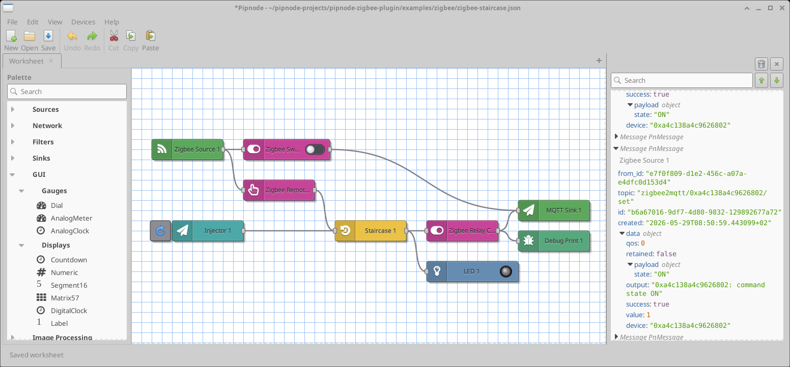
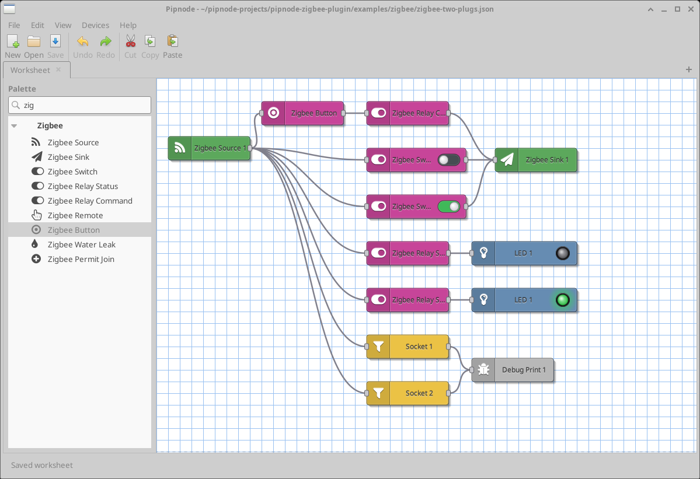
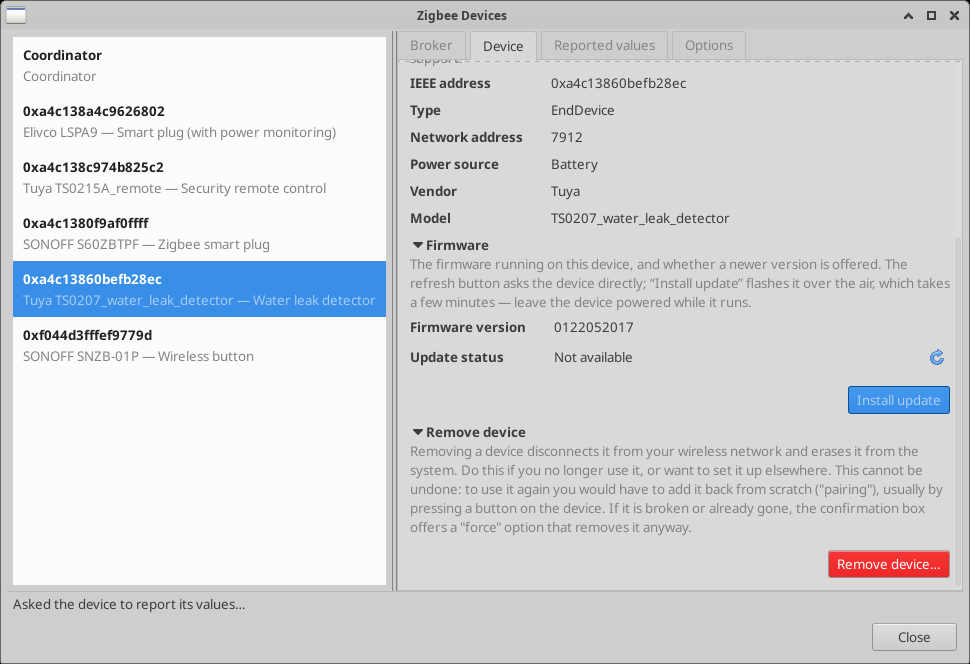

# pipnode-zigbee-plugin

Nodes for interacting with [Zigbee](https://csa-iot.org/all-solutions/zigbee/)
devices from [pipnode](https://github.com/laszlopere/pipnode) worksheets,
driving them via a [Zigbee2MQTT](https://www.zigbee2mqtt.io/) bridge.







> **Status: in progress.** The following node types are registered and
> usable: `PnZigbeeSource`, `PnZigbeeSwitch`, `PnZigbeeRelayStatus`,
> `PnZigbeeRelayCommand`, `PnZigbeeRemote`, and `PnZigbeeWaterLeak`. More
> (ZigbeeEvent, ZigbeePair, ZigbeeBridgeStatus, …) will be added
> incrementally.

This is **free software**, licensed under the **GNU GPL v3 or later**
(see [LICENSE](LICENSE) / [COPYING](COPYING)). It talks to the pipnode
host only through the documented plugin interface, so the combination is
covered by pipnode's `LICENSE.PLUGIN-EXCEPTION` (an additional permission
under GPL v3 §7); this plugin's own source and binaries are GPLv3. Pipnode
itself remains GPLv3-or-later — relicensing this plugin does not change
that.

## Architecture

A Zigbee USB dongle (e.g. AVATTO **GW70-MQTT**, a TI CC2652P + CP2102N
stick) is a Zigbee **radio**, not an MQTT endpoint — the "MQTT" in the
name is the ecosystem it targets, not a protocol it speaks. The full
chain is:

```
Zigbee devices  <--2.4 GHz radio-->  GW70 dongle  <--USB serial-->  Zigbee2MQTT  <--TCP-->  MQTT broker  <--TCP-->  pipnode (this plugin)
   (bulbs,                            (CC2652P                       (Node.js                (Mosquitto,             (subscribes to
    sensors)                           radio chip)                    daemon)                 etc.)                   zigbee2mqtt/* topics)
```

The dongle must be physically near the devices (radio range), but the
machine running Z2M can be a small satellite (Raspberry Pi, mini PC)
connected to a central broker over TCP/IP. This plugin sits at the far
right of the chain: it speaks MQTT to the broker and follows the
documented [Z2M topic / payload contract](https://www.zigbee2mqtt.io/guide/usage/mqtt_topics_and_messages.html).

Pipnode already ships MQTT Source / Sink primitives (the `network`
plugin); the value this plugin adds on top is Z2M-aware node types with
the right topic shapes, payload schemas, and device-discovery flow built
in.

## Building

Requires an installed pipnode with developer files (`pipnode-core.pc` on
the `pkg-config` path, headers under `$prefix/include/pipnode/`).

```sh
./autogen.sh           # only after a fresh git clone
./configure
make
sudo make install      # installs into pipnode's plugin dir
```

`configure` reads the install location straight from `pipnode-core.pc`
(`pkg-config --variable=plugindir pipnode-core`), so the module lands in
the directory the host scans at start-up — typically
`/usr/local/lib/pipnode/plugins/`.

### Per-user install (no sudo)

To test without installing system-wide, build and point pipnode at the
build tree:

```sh
make
PIPNODE_PLUGIN_PATH=$PWD/src/.libs pipnode
```

## Design notes

- **Headless / core-only.** Each Zigbee node is pure logic (MQTT
  publish / subscribe + JSON payloads), so the plugin links
  `pipnode-core` (the GTK-free tier) and builds a single
  `pipnode_zigbee.so`. It is server-installable and runs under
  `pipnode-run`. Node settings dialogs, when needed, should be
  expressed as a declarative settings schema to keep everything in the
  one core `.so`; only split off a `-gui.so` companion if the schema
  cannot describe the dialog.
- **Credentials.** MQTT broker host, port, username, password, TLS
  options and Z2M base topic belong in a host-provisioned profile
  (pipnode ABI v5), not in serialised node properties. Declare a
  `Zigbee2MQTTBrokerProfile` profile type (likely sharing the broker
  side with the network plugin's MQTT profile) and resolve it at run
  time rather than storing secrets in the worksheet file.
- **Topic / payload contract.** Follow Z2M's documented topic shape
  (`<base_topic>/<friendly_name>`, `<base_topic>/<friendly_name>/set`,
  `<base_topic>/bridge/*`). Treat that contract as the boundary; do
  not invent parallel naming.

See the `PLUGINS` guide in the pipnode source tree for the full plugin
contract.

## Adding a node (checklist)

1. Add `src/pn-zigbee-<node>.c` / `.h` defining a `PnNode` subclass
   (`G_DEFINE_TYPE`, set `class_name`/`icon`/`color`/`category`/
   `has_input`/`has_output`/`receive` in `_class_init`).
2. List the new sources in `src/Makefile.am`
   (`pipnode_zigbee_la_SOURCES`).
3. `pn_node_factory_register (factory, PN_TYPE_ZIGBEE_<NODE>)` in
   `src/pn-zigbee-plugin.c`.
4. Ship `help/PnZigbee<Node>.html` and wire `pnhelp_DATA` in
   `src/Makefile.am`.

## Sponsorship

This plugin is free and open source, and so is
[pipnode](https://github.com/laszlopere/pipnode) itself. If they are useful
to you, please consider sponsoring on
[**GitHub Sponsors**](https://github.com/sponsors/laszlopere). Sponsoring at
any tier funds continued development of the open-source pipnode ecosystem
for everyone.

## License

Copyright (C) 2026 Laszlo Pere. Licensed under the GNU General Public
License, version 3 or later — see [LICENSE](LICENSE) / [COPYING](COPYING).
The plugin reaches the pipnode host only through the documented plugin
interface, so the combination is permitted by pipnode's
`LICENSE.PLUGIN-EXCEPTION`; pipnode's own core stays GPLv3-or-later.
